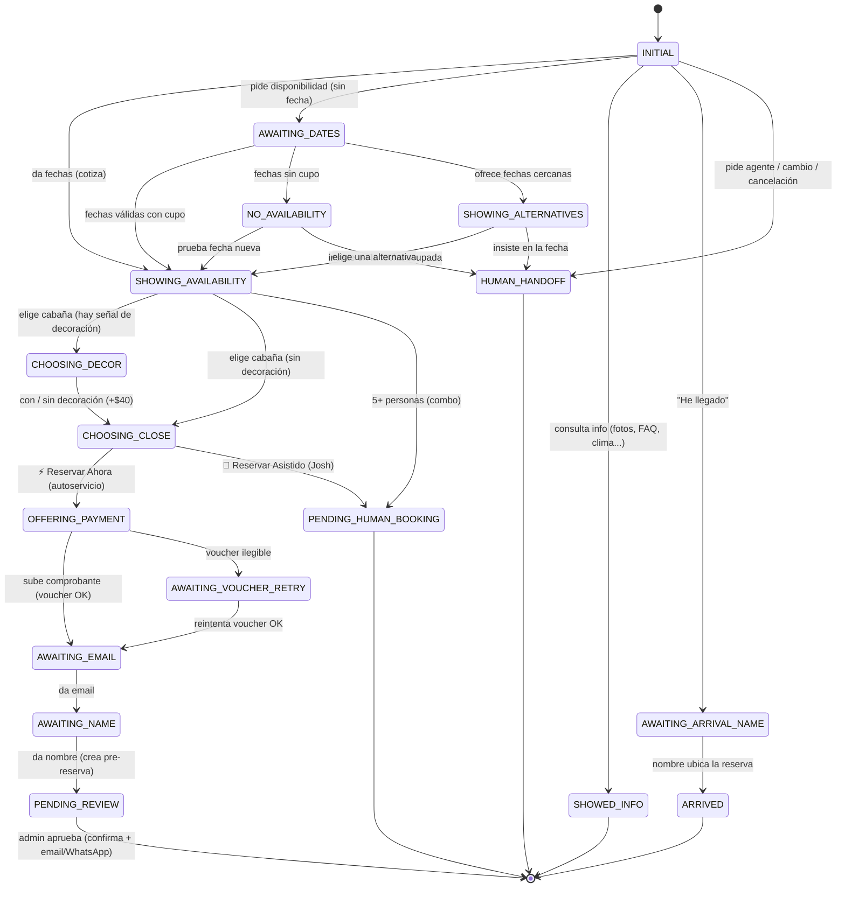

# Agente de WhatsApp — Mapa de flujo

Mapa visual del Agente (`apps-script/BotConsultor.gs`). GitHub renderiza
los diagramas Mermaid automáticamente al abrir este archivo. Para editarlos
visualmente: pegar el bloque en https://mermaid.live

---

## 1. Máquina de estados (ciclo de vida de la conversación)

Cada conversación tiene un `step` (columna en la hoja `Conversaciones`).
El estado define qué puede pasar con el siguiente mensaje.



---

## 2. Router de mensajes (orden de prioridad)

Cuando llega un mensaje, `botHandleMessage` lo evalúa de arriba hacia
abajo. El **primero que matchea, gana** (hace `return`). Por eso el orden
importa: lo más específico va primero, el LLM al final como red.

```mermaid
flowchart TD
  M([Mensaje entrante]) --> A{¿Es de Erika<br/>limpieza?}
  A -- sí --> AE[Parte de limpieza de hoy] --> Z([fin])
  A -- no --> B{¿Mensaje estructurado<br/>del calendario web?}
  B -- sí --> BE[Salta a formas de pago] --> Z
  B -- no --> C{¿Opener de campaña<br/>+ trae fechas?}
  C -- "con fechas" --> CE[Cotiza directo] --> Z
  C -- "sin fechas" --> CW[Pitch de bienvenida] --> Z
  C -- no --> D{¿Botón interactivo?<br/>pick / deco / close /<br/>approve / checkout / consulta}
  D -- sí --> DE[Handler del botón] --> Z
  D -- no --> E{¿Está en un paso<br/>del flujo?<br/>email / nombre / voucher}
  E -- sí --> EE[Procesa ese dato] --> Z
  E -- no --> F{¿Pide agente /<br/>cambio / cancelación?}
  F -- sí --> FE[Handoff a Josh] --> Z
  F -- no --> G{¿Insiste en fecha<br/>sin disponibilidad?}
  G -- sí --> GE[Handoff a Josh + alerta] --> Z
  G -- no --> H{¿Keyword de menú?<br/>cómo llegar / actividades /<br/>gastronomía / acceso 4x4 / bus}
  H -- sí --> HE[Responde ese tema] --> Z
  H -- no --> I{¿Fecha vaga?<br/>"para julio"}
  I -- sí --> IE[Manda calendario web] --> Z
  I -- no --> J{¿Info puntual?<br/>fotos / precio / clima /<br/>mascotas / decoración / niños}
  J -- sí --> JE[Responde info] --> Z
  J -- no --> K{¿Tiene pinta<br/>de fechas?}
  K -- sí --> KP[Parser determinista<br/>→ si falla, Claude NLU]
  KP --> KQ{¿Fechas válidas?}
  KQ -- sí --> KE[Cotiza disponibilidad] --> Z
  KQ -- no --> KF[Muestra tarifas / aclara] --> Z
  K -- no --> L{¿Mensaje con<br/>contenido real?}
  L -- sí --> LE[🤖 Claude fallback<br/>grounded en knowledge base] --> Z
  L -- no --> ME[Menú de bienvenida] --> Z
```

---

## 3. Estados — referencia rápida

| Estado | Significado | Etapa funnel |
|---|---|---|
| `INITIAL` | Llegó / saludo | A |
| `SHOWED_INFO` | Consultó info (curioso) | B |
| `AWAITING_DATES` | Pidió/iba a dar fechas | C |
| `SHOWING_AVAILABILITY` | Cotizó (vio cabañas libres) | D |
| `SHOWING_ALTERNATIVES` | Cotizó (alternativas) | D |
| `NO_AVAILABILITY` | Cotizó (sin cupo) | D |
| `CHOOSING_DECOR` | Eligió cabaña, decide decoración | E |
| `CHOOSING_CLOSE` | Eligió cabaña, decide cómo cerrar | E |
| `OFFERING_PAYMENT` | Autoservicio: formas de pago / voucher | E |
| `AWAITING_VOUCHER_RETRY` | Voucher ilegible, reintenta | E |
| `AWAITING_EMAIL` | Dando email | F |
| `AWAITING_NAME` | Dando nombre | F |
| `PENDING_REVIEW` | Pre-reserva creada (espera aprobación) | G |
| `PENDING_HUMAN_BOOKING` | Derivado a Josh para cerrar (asistido / grupo) | X |
| `HUMAN_HANDOFF` | Derivado a humano (agente / cambio / insistencia) | X |
| `AWAITING_ARRIVAL_NAME` | "He llegado" — verificando reserva | H |
| `ARRIVED` | Llegó a la cabaña (portón) | H |

> Nota: el funnel real (conteo por etapa) se mide con `analizarAgente()` en el editor de Apps Script.
